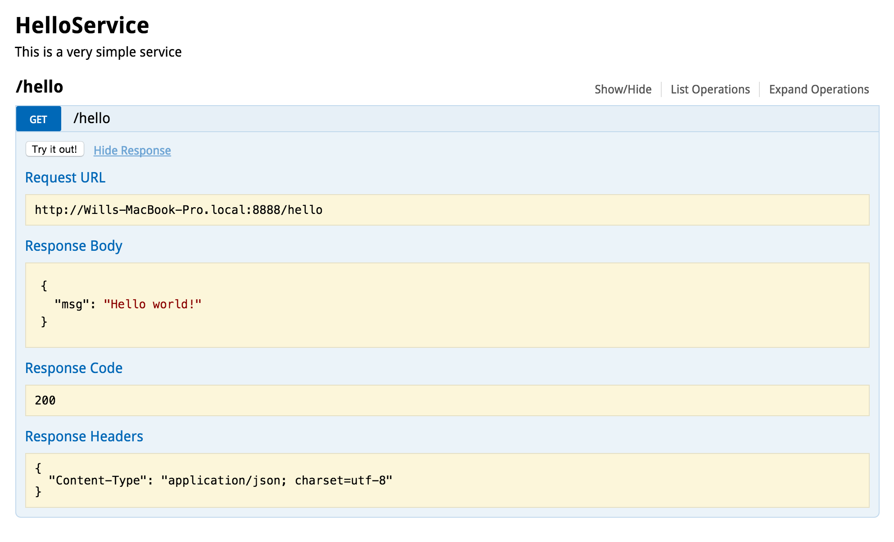

Getting started (Hello World)
----------

### Creating your first API

The first step is to create a standard Node.js package

```
<path-to-your-app>/
    package.json
```

Your package.json should include ```datanode```

```node
{
    "name": "hello-world",
    "description": "Hello World API",
    "engines": { "node": "~0.8.6" },
    "dependencies": {
        "datanode" : "> 0.0.0"
    }
}
```

Then install the package dependencies like this:

```
% cd <path-to-your-app>
% npm install .
```

Next we define the API. This is where the magic is. Create a file called HelloService.js:

```
<path-to-your-app>/
    package.json
    HelloService.js
```

HelloService.js
```node
var o = require('maker').o(module)
var __ = require('maker').__(module, true)

__(function() {
  module.exports = o({
    _type: 'datanode/ObjectServer',
    port: 8888,
    endpoints: {
      hello: o({
        _type: 'datanode/Endpoint',
        get: function(req) {
          return { msg: "Hello World!" }
        }
      })
    }
  })
})
```

```node 
var carbon = require('carbon')
var o = carbon.atom.o(module)
var _o = carbon.bond._o(module)
var __ = carbon.fibers.__(module, true)

__(function() {
  module.exports = o({
    _type: carbon.carbond.ObjectServer,
    port: 8888,
    endpoints: {
      hello: o({
        _type: carbon.carbond.Endpoint,
        get: function(req) {
          return { msg: "Hello World!" }
        }
      })
    }
  })
})
```

### Running the API

```console
% node HelloService.js
[Mon Feb 09 2015 21:56:41 GMT-0800 (PST)] INFO: ObjectServer starting...
[Mon Feb 09 2015 21:56:41 GMT-0800 (PST)] INFO: ObjectServer listening on port 8888
[Mon Feb 09 2015 21:56:41 GMT-0800 (PST)] INFO: ObjectServer running
```

### Connecting to the API

You now have a RESTful web service running on port 8888. You can connect to it via HTTP in a variety of ways. 

**Simple curl test**

```console
% curl localhost:8888/hello
{ "msg": "Hello World!" }
%
```

**API Browser**

In your web browser navigate to [http://localhost:8888/apidoc](http://localhost:8888/apidoc) to use the auto-generated API Browser. 



### More examples

Studying examples is a great way to learn. We have an entire [github repository full of runnable examples](https://github.com/willshulman/datanode-examples) to explore. 
